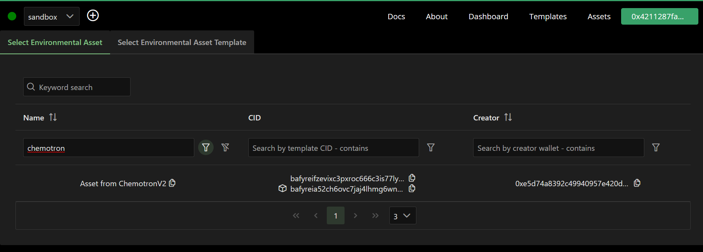

# About C02 Storage Handler

Our Co2 storage handler handles interaction between the IoT and co2.storage, we stream our IoT data and funnel it to co2.storage with a custom built template.

# Chemotronix Custom Schema

```
{
  "Id": {
      "type": "int",
      "mandatory": true
    },
    "Created At": {
      "type": "datetime",
      "mandatory": true
    },
    "Temperature": {
      "type": "float",
      "mandatory": true
    },
    "Humidity": {
      "type": "float",
      "mandatory": true
    },
    "Pressure": {
      "type": "float",
      "mandatory": true
    },
    "Altitude": {
      "type": "float",
      "mandatory": true
    },
    "Carbon Monoxide": {
      "type": "float",
      "mandatory": true
    },
    "Methane": {
      "type": "float",
      "mandatory": true
    },
    "Carbon Dioxide": {
      "type": "float",
      "mandatory": true
    },
    "Total Emissions Per hour": {
      "type": "float",
      "mandatory": true
    }
  }

```

# Asset Images

The IoT device Prototype




