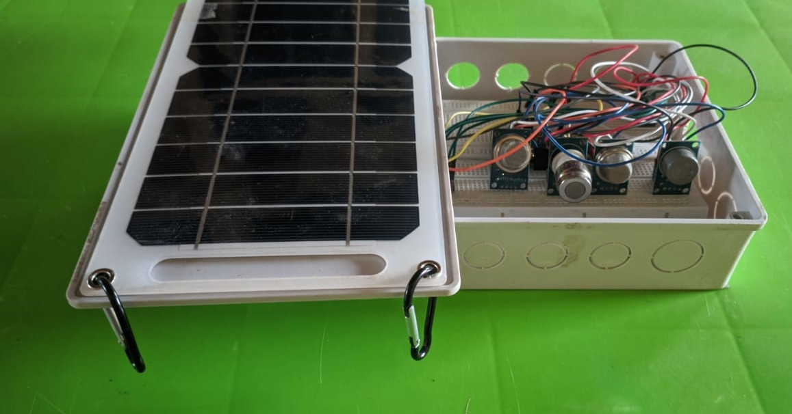
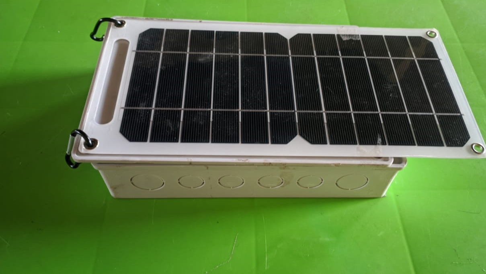
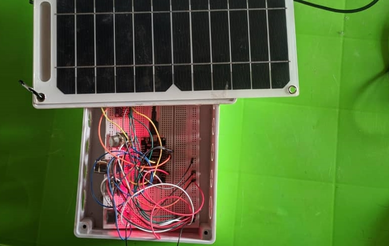

# Chemotron-v2
The Chemotron V3 project is a subsidiary of the chemotronix project. The Chemotron V3 is the 3rd iteration of the IoT device for tracking carbon emissions. 

The uniqueness of this version is that it connects directly to the blockchain to log data from low cost carbon tracking sensors. Specifically, it leverages web3.storage which is an ipfs. This helps to keep the data secure and decentralized as we intend to avoid tampering of the data.

# IoT Images

Inside_the_IoT_device_prototype

Inside_the_IoT_device_prototype

IoT_sending_data_live_to_Web3storage

