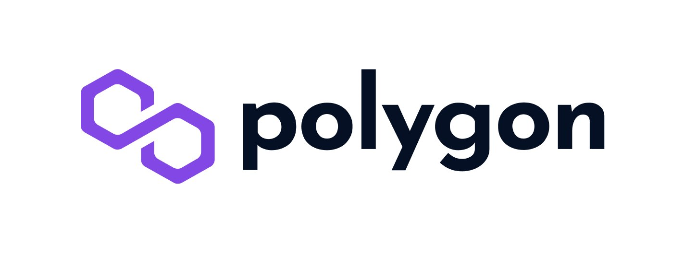

# About Chemotronix

Chemotronix is a unique blend of IoT, A.I and Blockchain, which fosters the reduction of carbon emissions in Africa, allowing users to trade carbon credits. 

A company that wishes to use the services of Chemotronix receives an IoT device, this IoT device has a unique ID that is registered on the blockchain. With this unique ID, users and companies can track their carbon emissions which are immutably stored on web3storage(IPFS) by Filecoin and are processed in the blockchain such that the carbon credits associated with the device are burned periodically. With the unique ID, users can transfer and share carbon credits(**an ERC-20 token**) among themselves without needing to remember their lengthy wallet addresses.

The carbon emissions data from the IoT device is saved to web3storage(built on IPFS) by Filecoin, instead of traditional cloud storage, to avoid a single point of failure and maintain transparency. The data is then used to equivalently charge companies with carbon credits.

The data from the IoT device is also analyzed using A.I such that stakeholders can forecast carbon emissions and take actions 
to gradually reduce it.

# Blockchain technologies deployed at Chemotronix

Polygon enabled us to build a scalable blockchain ecosystem, with minimal transaction fees. Polygon was used to create an ERC-20 token called CMX, which essentially serves as carbon credits for users to trade on the blockchain, enabling carbon emitters to effectively offset their carbon emissions as they were tracked by the IoT device.

Graph Protocol was used to query the blockchain, while Alchemy was used to host an RPC node through which our dApp was able to retrieve blockchain information.

The ERC-20 Token smart contract asides several other functionalities has been deployed, and it is currently active on the Polygon Testnet Explorer here: https://mumbai.polygonscan.com/address/0xd90D2495f296a537B8A73D9C7769C3e23694273a

# IoT Images

The IoT device Prototype

IoT sending data live to Web3storage

# Major Blockchain Technologies Used

